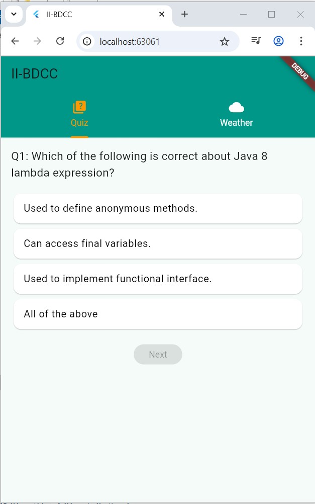
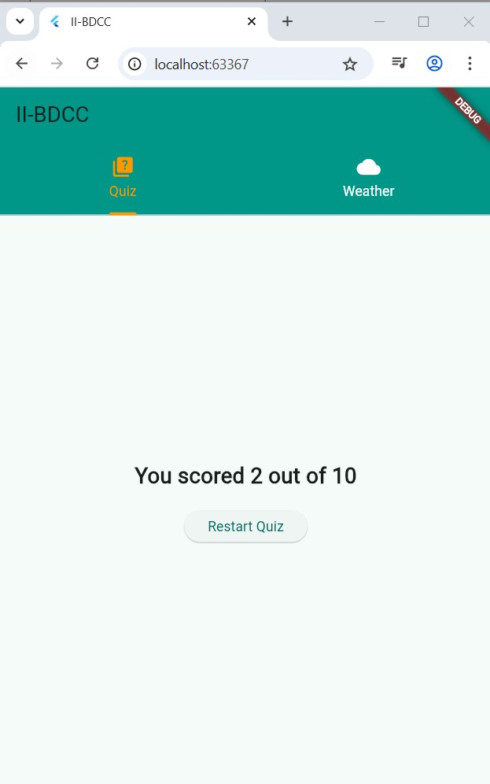
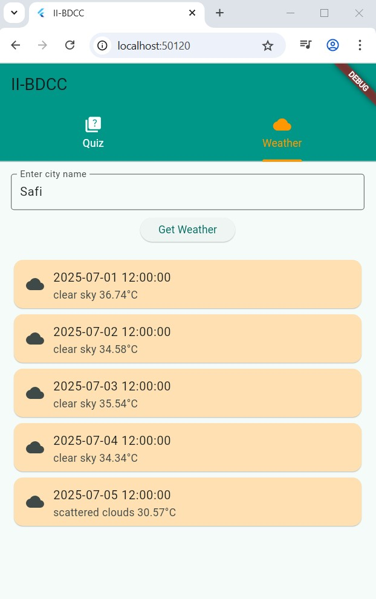

# II-BDCC Flutter App – Modules Quiz & Weather

This project is a Flutter web/mobile application featuring two main modules:

---

## 📘 1. Quiz Module

### 🧩 Description:
The quiz module displays 10 multiple-choice questions (MCQs) about Flutter, Dart, Java, etc.

- ✅ Each question has 4 options.
- ✅ The user selects an answer and presses "Next".
- ✅ At the end, the score is displayed: `You scored X out of 10`.
- ✅ A "Restart Quiz" button allows retrying the quiz.

### 🔧 Technical Features:
- `List<Question>` to store questions.
- `setState()` used to track current question and selected answer.
- Score is calculated in real-time.
- Visual feedback for selected answers.

### 📸 Screenshots:
### Quiz questions:

### Quiz score:


---

## 🌦 2. Weather Module

### 🌍 Description:
Allows the user to search a city and get the 5-day forecast from OpenWeatherMap.

- ✅ Uses OpenWeatherMap API
- ✅ `.env` file holds the API key (for security)
- ✅ Weather data filtered at 12:00:00 each day
- ✅ Displayed as cards (date + description + temperature)

### 🔧 Technical Features:
- Uses `flutter_dotenv` to load `.env`
- Uses `http` for GET requests to weather API
- Handles errors and loading states
- Compatible with Flutter Web (declared `.env` in assets)

### 📸 Screenshot:
### Weather resulat for my city Safi: 


---

## 🔐 Example `.env` File (at project root)
```
OPENWEATHER_API_KEY=your_openweathermap_api_key
```

---

## 📁 Folder Structure Summary
```
lib/
├── main.dart          # App entry with TabBar (Quiz / Weather)
├── quiz_page.dart     # Quiz logic, scoring, and UI
├── weather_page.dart  # API call, filtering, and UI display


└── .env               # API key stored here

captures/
├── quiz_questions.jpg # Screenshot of quiz interface
├── score_quiz.jpg     # Screenshot of final quiz result
└── weather.jpg        # Screenshot of weather module
```

---

## ✅ How to Run

```bash
flutter pub get
flutter run -d chrome
```

Make sure your `.env` file is added in `pubspec.yaml`:

```yaml
flutter:
  uses-material-design: true
  assets:
    - .env
```

---

## 👨‍💻 Author

Abdellah Lambaraa – II-BDCC Project